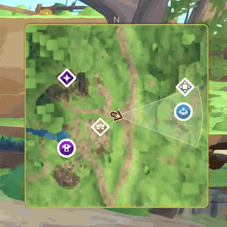
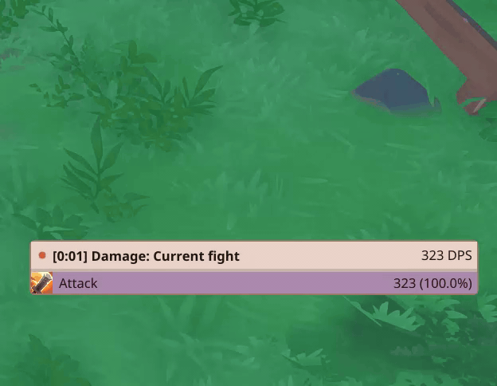
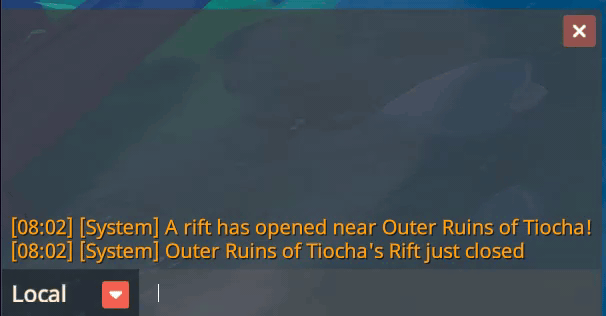

# Farever More

An add-on framework for the Steam version of
[Farever](https://store.steampowered.com/app/3672400/Farever/). Add-ons are
written in Rust and built as WebAssembly components. The native Windows host
loads them, reads selected game state, and draws their overlays.

Farever More is still in early development, so the add-on API and installer may
change. It currently supports Windows x86-64. Linux and Proton are not
supported yet; Linux support is planned for a future release.

## What you can build

Farever More includes a Rust SDK and build tools for add-on authors, a desktop
manager, and an installer. It also comes with reference add-ons for damage
tracking, GPS waypoints, the minimap, and points of interest. The repository
includes an item-search tool, a Farever API inspector, and game data used by
the add-ons.

## Addons

<table>
  <tr>
    <th>Minimap and points of interest</th>
    <th>Damage meter</th>
  </tr>
  <tr>
    <td align="center"></td>
    <td align="center"></td>
  </tr>
  <tr>
    <th colspan="2">Chat commands</th>
  </tr>
  <tr>
    <td colspan="2" align="center"></td>
  </tr>
</table>

## Build and install

See the [build and install guide](docs/build-and-install.md) for requirements,
commands, and installer details.

Contributor checks are listed in [CONTRIBUTING.md](CONTRIBUTING.md). The
[architecture guide](docs/architecture.md) lists supported game builds and
where more in-game QA is needed. The
[framework documentation index](docs/README.md) covers the framework. Guides
for the [damage meter](addons/dyno/README.md), [GPS](addons/gps/README.md), and
[minimap](addons/minimap/README.md) live alongside their source.

## Release history

See [CHANGELOG.md](CHANGELOG.md) for release history.

## Credits

Farever More was inspired by ramisotti13-eng's [Farever Minimap & DPS
project](https://github.com/ramisotti13-eng/farever-minimap). The W1 map and
POI atlas assets come from its [v1.2.7
release](https://github.com/ramisotti13-eng/farever-minimap/releases/tag/v1.2.7);
the minimap's player arrow is custom artwork authored in SVG and bundled as a
pre-rendered PNG.

Farever More is an unofficial community project, not affiliated with or
endorsed by the Farever developers. Farever names, artwork, maps, and other
game-derived content remain subject to their respective rights holders. See
[third-party notices](THIRD_PARTY_NOTICES.md) for asset and data attributions.

## Support

